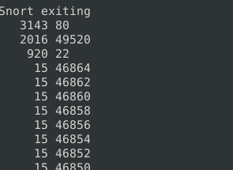
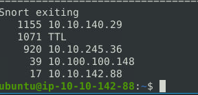
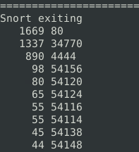

# 🛡️ Snort Detection Labs: Brute-Force & Reverse Shell Attack Walkthrough

This repository documents two real-world Snort detection scenarios where I analyzed, detected, and blocked cyberattacks using custom Snort rules, CLI traffic parsing, and IPS mode deployment.

## 📁 Lab Structure

- **Task 1**: Detecting & stopping SSH brute-force attacks on port 22  
- **Task 2**: Investigating outbound traffic for reverse shells (Metasploit on port 4444)

---

## 🧪 Task 1: SSH Brute-Force Attack Detection

### ✅ Objective  
Detect an SSH brute-force attack and stop it using Snort in IPS mode.

### 🔍 Packet Capture & Sniffing  
`sudo snort -i eth0 -X -l .`  
Captured deep packet inspection data and logged results locally.

### 📊 Port Analysis  
`sudo snort -r snort.log.xxxxxxx -X | grep "->" | awk -F'->' '{print $2}' | awk -F':' '{print $2}' | sort | uniq -c | sort -nr`  
Revealed frequent use of port **22**, suggesting an SSH brute-force attempt.

### 🧠 Attacker IP Extraction  
`sudo snort -r snort.log.xxxxxxx -v | grep ':22' | awk -F'->' '{print $1}' | awk -F' ' '{print $2}' | awk -F':' '{print $1}' | sort | uniq -c | sort -nr`  
Identified the attacker as `10.10.245.36`, targeting `10.10.140.29`.

### ✍️ Snort Rule (`local.rules`)  
`drop tcp any any -> any 22 (msg:"SSH attack"; sid:100001; rev:1;)`

### 🚀 Run Snort in IPS Mode  
`sudo snort -c /etc/snort/snort.conf -q -Q --daq afpacket -i eth0:eth1 -A full`

### 🎯 Result  
**Flag:** `THM{81b7fef657f8aaa6e4e200d616738254}`  
**Protocol:** TCP/22  
**Service:** SSH

---

## 🧪 Task 2: Reverse Shell Detection (Outbound)

### ✅ Objective  
Detect and stop a reverse shell connection using outbound port 4444 (Metasploit).

### 🔍 Packet Capture  
`sudo snort -i eth0 -X -l .`

### 📊 Port Usage Check  
`sudo snort -r snort.log.xxxxxxx -X | grep "->" | awk -F'->' '{print $2}' | awk -F':' '{print $2}' | sort | uniq -c | sort -nr`  
Revealed suspicious activity on **port 4444**.

 

### 🧪 tcpdump Verification  
`sudo tcpdump -nnr snort.log.xxxxxxx | grep -E '4444|34770|80'`

### ✍️ Snort Rule (`local.rules`)  
`alert tcp any any -> any 4444 (msg:"Test rule"; sid:999999; rev:1;)`

### 🚀 IPS Mode Execution  
`sudo snort -c /etc/snort/snort.conf -q -Q --daq afpacket -i eth0:eth1 -A full`

### 🎯 Result  
**Flag:** `THM{0ead8c494861079b1b74ec2380d2cd24}`  
**Protocol:** TCP/4444  
**Associated Tool:** Metasploit

---

## 📘 Tools & Tips

Snort CLI filtering toolkit and reusable parsing tricks are available in:  
`tools/snort-cheatsheet.md`

---

## 🧠 What I Learned

- How to analyze logs for port/IP patterns using CLI tools  
- Real-time detection vs passive packet logging with Snort  
- Writing actionable IPS rules based on observed traffic  
- The value of detecting outbound traffic, not just incoming

---

